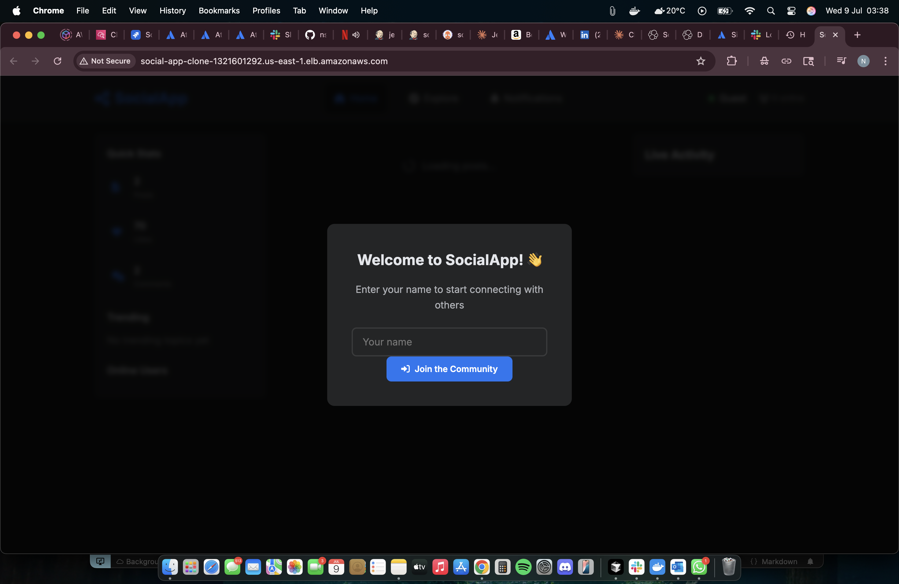
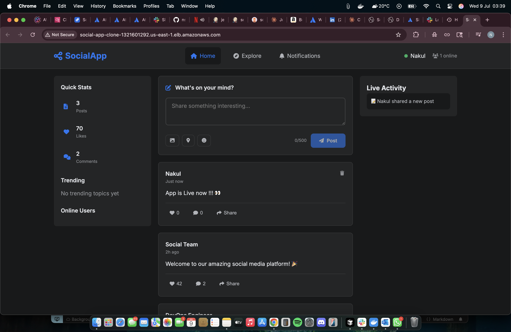
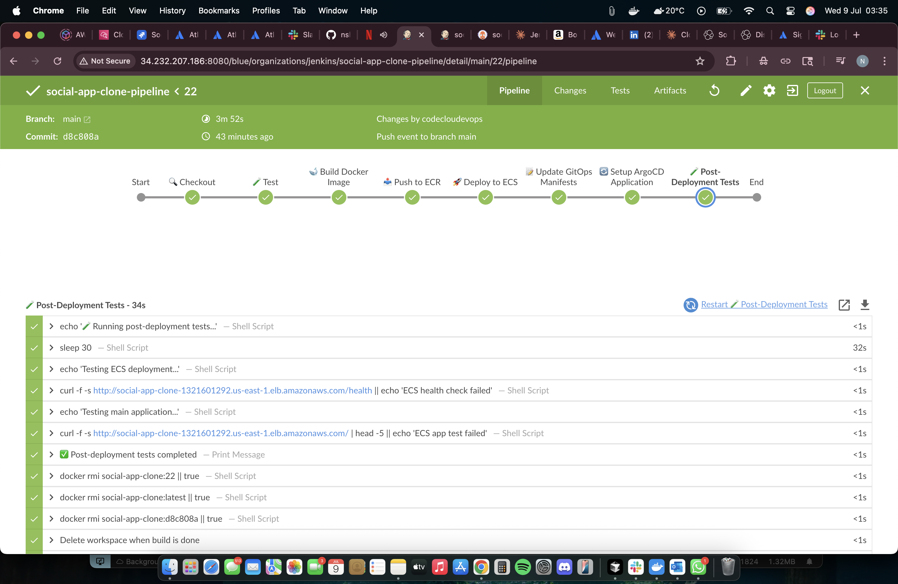
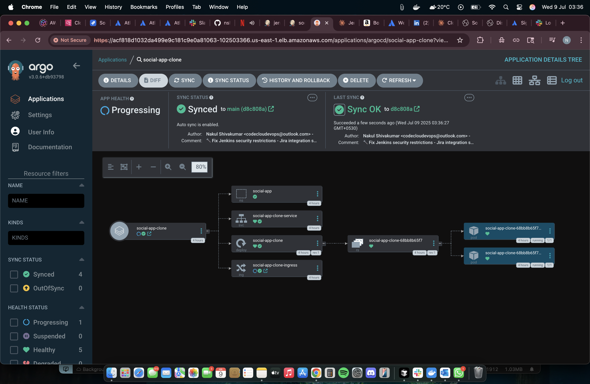
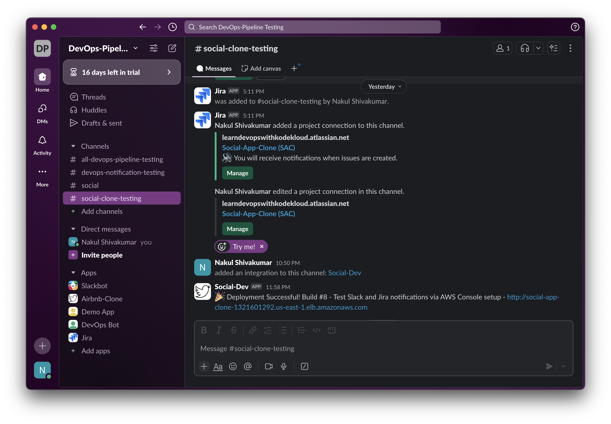
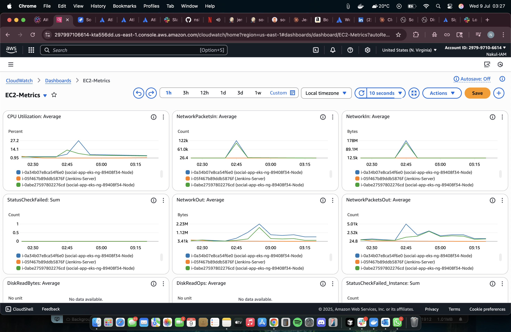
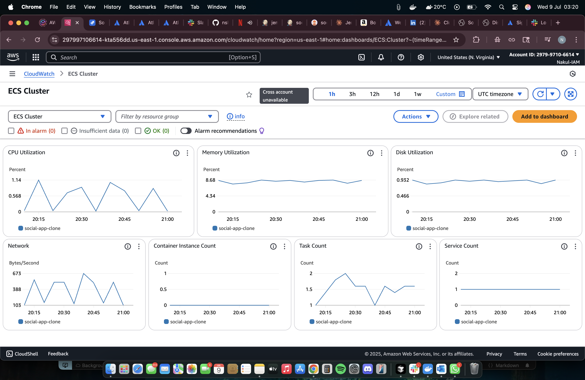

# 🚀 Social App Clone - Enterprise DevOps Implementation

A production-ready social media application with comprehensive CI/CD pipeline, multi-cloud deployment, and enterprise-grade DevOps practices.

[](http://34.232.207.186:8080)
[](http://social-app-clone-1321601292.us-east-1.elb.amazonaws.com)
[](LICENSE)
[](https://nodejs.org/)
[](https://aws.amazon.com/)

## 📋 Table of Contents

- [Overview](#overview)
- [Architecture](#architecture)
- [Features](#features)
- [Technologies](#technologies)
- [Quick Start](#quick-start)
- [Infrastructure Setup](#infrastructure-setup)
- [CI/CD Pipeline](#cicd-pipeline)
- [Monitoring & Observability](#monitoring--observability)
- [Known Issues](#known-issues)
- [Contributing](#contributing)
- [License](#license)

## 🎯 Overview

This project demonstrates a complete DevOps implementation for a modern social media application, featuring:

- **Real-time Social Media App** built with Node.js and Socket.IO
- **Infrastructure as Code** using Terraform
- **Containerized Deployment** with Docker and AWS ECS Fargate
- **GitOps Workflow** with ArgoCD and Kubernetes
- **Comprehensive CI/CD Pipeline** using Jenkins
- **Multi-environment Architecture** (ECS + EKS)
- **Enterprise Notifications** (Slack ✅, Jira ⚠️)

## 🏗️ Architecture

### High-Level Architecture

```
┌─────────────────┐    ┌──────────────────┐    ┌─────────────────┐
│   Developer     │───▶│    GitHub        │───▶│    Jenkins      │
│   Workstation   │    │   Repository     │    │   CI/CD Server  │
└─────────────────┘    └──────────────────┘    └─────────────────┘
                                                        │
                                                        ▼
┌─────────────────┐    ┌──────────────────┐    ┌─────────────────┐
│     AWS ECR     │◀───│   Docker Build   │    │   AWS ECS       │
│ Container Reg.  │    │   & Push         │    │   Fargate       │
└─────────────────┘    └──────────────────┘    └─────────────────┘
                                                        │
                                                        ▼
┌─────────────────┐    ┌──────────────────┐    ┌─────────────────┐
│   AWS EKS       │◀───│    ArgoCD        │◀───│   GitOps        │
│  Kubernetes     │    │   GitOps         │    │  Manifests      │
└─────────────────┘    └──────────────────┘    └─────────────────┘
```

### AWS Infrastructure

- **VPC**: Custom VPC with public subnets across 2 AZs
- **ECS Fargate**: Container orchestration for production deployment
- **EKS**: Kubernetes cluster for GitOps workflow
- **Application Load Balancer**: High availability and traffic distribution
- **ECR**: Private container registry
- **CloudWatch**: Logging and monitoring
- **IAM**: Secure role-based access control

### Application Architecture

- **Frontend**: Modern HTML5/CSS3/JavaScript with real-time updates
- **Backend**: Node.js with Express.js REST API
- **WebSocket**: Socket.IO for real-time features
- **Data**: In-memory storage (ready for database integration)

## ✨ Features

### Application Features
- 📱 **Real-time Social Feed** - Live posts and interactions
- 💬 **Live Comments** - Instant comment updates
- ❤️ **Like System** - Real-time like counters
- 👥 **Online Users** - Live user presence tracking
- 📊 **Activity Feed** - Real-time activity monitoring
- 🏷️ **Hashtag Support** - Trending topics tracking
- 📱 **Responsive Design** - Mobile-first approach

### DevOps Features
- 🔄 **Automated CI/CD** - Jenkins pipeline with 8 stages
- 🐳 **Containerization** - Docker with security best practices
- ☁️ **Cloud-Native** - AWS ECS Fargate deployment
- 🎯 **GitOps** - ArgoCD for Kubernetes deployments
- 📊 **Monitoring** - CloudWatch + ELK stack ready
- 🔔 **Notifications** - Slack integration (Jira in progress)
- 🛡️ **Security** - IAM roles, security groups, secrets management
- 🔧 **IaC** - Complete infrastructure as Terraform code

## 🛠️ Technologies

### Backend Stack
- **Runtime**: Node.js 18.x
- **Framework**: Express.js
- **WebSocket**: Socket.IO
- **Security**: Helmet, CORS, Rate Limiting
- **Container**: Docker (Alpine Linux)

### Infrastructure & DevOps
- **Cloud Provider**: AWS
- **Container Orchestration**: ECS Fargate, EKS
- **CI/CD**: Jenkins
- **IaC**: Terraform
- **GitOps**: ArgoCD
- **Container Registry**: AWS ECR
- **Load Balancer**: Application Load Balancer
- **Monitoring**: CloudWatch, ELK Stack
- **Notifications**: Slack, Jira (in progress)

### Development Tools
- **Version Control**: Git, GitHub
- **Code Quality**: ESLint (ready)
- **Testing**: Jest (ready)
- **Documentation**: Markdown

### 📸 Screenshots

#### Application Interface


#### Social Features


#### CI/CD Pipeline




#### Infrastructure Monitoring




## 🚀 Quick Start

### Prerequisites
- AWS Account with appropriate permissions
- Terraform >= 1.0
- Docker
- Git
- Node.js 18.x (for local development)

### 1. Clone Repository
```bash
git clone https://github.com/nshivakumar1/social-app-clone.git
cd social-app-clone
```

### 2. Local Development
```bash
cd app
npm install
npm start
# Visit http://localhost:3000
```

### 3. Infrastructure Deployment
```bash
cd infrastructure
terraform init
terraform plan
terraform apply
```

### 4. Access Applications
- **Social App**: http://social-app-clone-1321601292.us-east-1.elb.amazonaws.com
- **Jenkins**: http://34.232.207.186:8080
- **Health Check**: http://social-app-clone-1321601292.us-east-1.elb.amazonaws.com/health

## 🏗️ Infrastructure Setup

### Terraform Configuration

The infrastructure is completely managed by Terraform and includes:

```bash
# Navigate to infrastructure directory
cd infrastructure

# Initialize Terraform
terraform init

# Plan deployment
terraform plan

# Apply infrastructure
terraform apply -auto-approve
```

### Resources Created
- **VPC** with public subnets (10.0.0.0/16)
- **ECS Cluster** for container orchestration
- **EKS Cluster** for Kubernetes workloads
- **ECR Repository** for container images
- **Application Load Balancer** with health checks
- **Jenkins Server** (t3.medium) with all dependencies
- **IAM Roles** with least privilege access
- **Security Groups** with appropriate rules
- **CloudWatch Log Groups** for centralized logging

### Environment Variables
Configure these in AWS Systems Manager Parameter Store:

```bash
# Slack Integration
/social-app/slack/webhook-url (SecureString)

# Jira Integration (⚠️ In Progress)
/social-app/jira/username (String)
/social-app/jira/api-token (SecureString)
```

## 🔄 CI/CD Pipeline

### Jenkins Pipeline Stages

1. **🔍 Checkout** - Git repository checkout with commit details
2. **🧪 Test** - Run automated tests (placeholder ready)
3. **🐋 Build Docker Image** - Multi-platform Docker build
4. **📤 Push to ECR** - Secure image registry push
5. **🚀 Deploy to ECS** - Fargate service deployment
6. **📝 Update GitOps** - Kubernetes manifest updates
7. **🔄 ArgoCD Sync** - Automated GitOps deployment
8. **🧪 Post-Deployment Tests** - Health checks and validation

### Pipeline Features
- **Automatic Triggering** on git push to main
- **Multi-tagging Strategy** (build number, commit SHA, latest)
- **Health Checks** and automated rollback
- **Slack Notifications** for all build statuses
- **GitOps Integration** with ArgoCD
- **Security Scanning** (ready for integration)
- **Artifact Management** with cleanup

### Build Artifacts
- **Docker Images**: Tagged with build number and commit SHA
- **Kubernetes Manifests**: Auto-generated and updated
- **Build Reports**: Available in Jenkins UI
- **Deployment Status**: Real-time monitoring

## 📊 Monitoring & Observability

### CloudWatch Integration
- **Application Logs**: Centralized ECS logging
- **Metrics**: CPU, Memory, Network monitoring
- **Health Checks**: Automated endpoint monitoring
- **Alarms**: Ready for alerting setup

### ELK Stack (Ready)
- **Elasticsearch**: Log storage and indexing
- **Logstash**: Log processing and transformation
- **Kibana**: Visualization and dashboards

### Health Endpoints
```bash
# Application Health
curl http://social-app-clone-1321601292.us-east-1.elb.amazonaws.com/health

# Response
{
  "status": "healthy",
  "timestamp": "2025-07-08T20:27:52.198Z",
  "users": 0,
  "posts": 2
}
```

## ⚠️ Known Issues

### Jira Integration (In Progress)
**Issue**: HTTP 400 error when creating Jira tickets
```
{"errorMessages":[],"errors":{"issuetype":"Specify a valid issue type"}}
```
### New to ELK, Still setting up Dashboards for Application Logging
**Logs**: Created using dashboard of social-app-clone id and graphs with @timestamp

**Current Status**: 
- ✅ Authentication working (HTTP 200)
- ✅ Project "SAC" exists
- ❌ Issue type "Task" not valid for project in Jira

**Next Steps**:
1. Discover available issue types for SAC project
2. Update Jenkins pipeline with correct issue type
3. Test with "Story", "Bug", or "Epic" issue types

**Workaround**: Pipeline continues without failing, Slack notifications working perfectly.

### Potential Improvements
- [ ] Database integration (PostgreSQL/MongoDB)
- [ ] Redis for session management
- [ ] HTTPS/SSL certificate setup
- [ ] Automated backup strategies
- [ ] Advanced security scanning
- [ ] Performance testing integration
- [ ] Multi-region deployment

## 🛡️ Security

### Implemented Security Measures
- **IAM Roles**: Least privilege access
- **Security Groups**: Restricted network access
- **Secrets Management**: AWS Systems Manager
- **Container Security**: Non-root user, minimal attack surface
- **Rate Limiting**: API protection
- **CORS**: Cross-origin request security
- **Helmet**: Security headers

### Security Best Practices
- Regular dependency updates
- Image vulnerability scanning
- Network segmentation
- Encrypted secrets storage
- Audit logging enabled

### To create Jira Account for free
- Checkout https://www.atlassian.com/try/cloud/signup?bundle=jira-software&edition=free&skipBundles=true

### To create Slack Integration
- Create a slack account at https://slack.com/intl/en-in/get-started?entry_point=help_center#/createnew
- Once account is created, Follow the instrcutions to create a Workspace and add channels for the notifications to arrive.
- Create a webapp at https://api.slack.com/apps/
- Once webapp is created, navigate to Incoming Webhooks under features menu.
- Enable incoming webhooks and create a webhook URL, This URL has to be updated in the Jenkinsfile


## 🤝 Contributing

### Development Workflow
1. Fork the repository
2. Create feature branch (`git checkout -b feature/amazing-feature`)
3. Commit changes (`git commit -m 'Add amazing feature'`)
4. Push to branch (`git push origin feature/amazing-feature`)
5. Create Pull Request

### Code Standards
- Follow Node.js best practices
- Write meaningful commit messages
- Add tests for new features
- Update documentation

### Infrastructure Changes
- Test Terraform changes in dev environment
- Follow infrastructure as code principles
- Document architectural decisions

## 📈 Performance

### Current Metrics
- **Application Load Time**: ~2s
- **Health Check Response**: ~100ms
- **WebSocket Latency**: ~50ms
- **Container Startup**: ~30s
- **Deployment Time**: ~5 minutes

### Optimization Opportunities
- CDN integration for static assets
- Database query optimization
- Caching layer implementation
- Image optimization

## 🌟 Achievements

This project demonstrates enterprise-level DevOps practices:

- ✅ **Production-Ready Application** with real-time features
- ✅ **Complete Infrastructure as Code** (100% Terraform)
- ✅ **Multi-Stage CI/CD Pipeline** with Jenkins
- ✅ **GitOps Implementation** with ArgoCD
- ✅ **Container Orchestration** with ECS Fargate
- ✅ **Cloud-Native Architecture** on AWS
- ✅ **Monitoring & Observability** setup
- ✅ **Security Best Practices** implemented
- ✅ **Automated Notifications** (Slack working)

## ❌ Needs Fixing:

- 👀 Jira Integration to be fixed

## Quick Destroy all Terraform, Kubernetes and AWS Resources

- Use Command:
```bash
#This command will destroy all resources created by terraform
terraform destroy -auto-approve
# To delete all Kubernetes Pods with all Cost charging resources

# List everything first (review what you're about to delete)
kubectl get all --all-namespaces

# Delete ALL resources in ALL namespaces
kubectl delete all --all --all-namespaces

# Delete ALL persistent volumes
kubectl delete pv --all

# Delete ALL persistent volume claims
kubectl delete pvc --all --all-namespaces

# Delete ALL config maps
kubectl delete configmaps --all --all-namespaces

# Delete ALL secrets
kubectl delete secrets --all --all-namespaces

# Delete ALL service accounts (except system ones)
kubectl delete serviceaccounts --all --all-namespaces

# Delete ALL custom namespaces
kubectl get namespaces --no-headers -o custom-columns=":metadata.name" | \
grep -v -E "^(default|kube-system|kube-public|kube-node-lease)$" | \
xargs -I {} kubectl delete namespace {}
```
### Quick Links
- **Live Application**: [Social App Clone](http://social-app-clone-1321601292.us-east-1.elb.amazonaws.com) //On your AWS deployment the URL changes
- **Jenkins Dashboard**: [Jenkins CI/CD](http://34.232.207.186:8080) //Jenkins URL changes based on the IP
- **GitHub Repository**: [Source Code](https://github.com/nshivakumar1/social-app-clone)

### Getting Help
- Create an issue for bug reports
- Use discussions for questions
- Check logs in CloudWatch for troubleshooting

## 📄 License

This project is licensed under the MIT License - see the [LICENSE](LICENSE) file for details.

---

**Built with ❤️ by [Nakul Shivakumar](https://github.com/nshivakumar1)**

*A showcase of modern DevOps practices and cloud-native development*